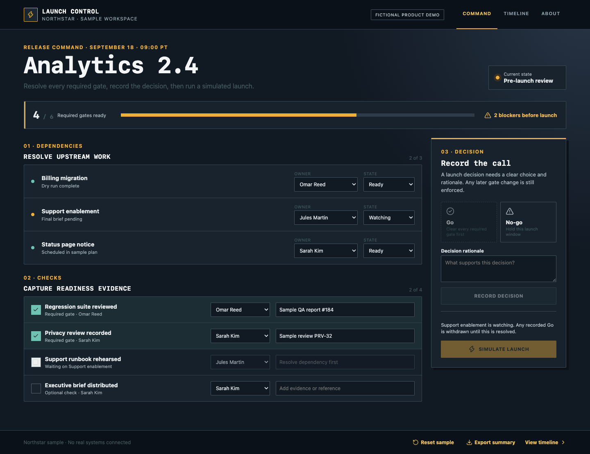

# Launch Control

Launch readiness often lives across checklists, status documents, and chat. This product management case study explores how a B2B SaaS launch lead can enforce prerequisites, capture decision evidence, and preserve a clear response trail.

**[Try the interactive demo](https://mvahedi2020.github.io/Launch-Control/)** · [Watch the workflow](docs/media/workflow.webm) · [Read the case study](docs/product/Case_Study.md)

## Try this decision

Northstar, a fictional operations platform, is preparing Analytics 2.4. Resolve Support enablement, complete the now-unlocked runbook check with sample evidence, record a go decision, and run the simulated launch. Trigger the sample post-launch issue and choose pause or rollback. Review the timestamped timeline or export the launch summary.

## My role

I use this case study to make product definition, launch policy, workflow design, requirements, and evaluation visible. The prototype was implemented with Google Antigravity; preparation and verification of this version were assisted by AI tools. This is a personal product case study, not a claim that I wrote the application code or managed an engineering team.

## Product decisions

| Decision | Why | Tradeoff |
|---|---|---|
| Unlock checks only after prerequisites clear | Keep the sequence operationally credible | Teams cannot complete work out of order |
| Require owner, evidence, and a recorded go | Turn readiness into an enforced rule | The final review takes deliberate effort |
| Require pause or rollback for the sample issue | Make response accountability visible | The demo models only two response paths |

## What works

Editable dependency owners and states, prerequisite-locked readiness checks, mandatory evidence, recorded go/no-go rationale, enforced simulated launch, timestamped activity, a sample post-launch issue, pause/rollback decisions, browser persistence, reset, and JSON summary export.

All people, evidence, launch records, and outcomes are fictional. No control deploys software, messages people, changes traffic, or connects to a production system. Changes stay in your browser. This project is independent of the other Northstar portfolio demonstrations. No measured customer outcomes or completed human research are claimed.

## Product evidence

- [Case study](docs/product/Case_Study.md)
- [Control matrix](docs/product/Control_Matrix.md)
- [Requirements and proposed success measures](docs/product/PRD.md)
- [Commercial hypotheses](docs/product/GTM_Strategy.md)
- [Implemented / next / later](docs/product/Sprint_Backlog.md)
- [Prototype validation](docs/product/Validation.md)
- [Contributor setup](CONTRIBUTING.md)
